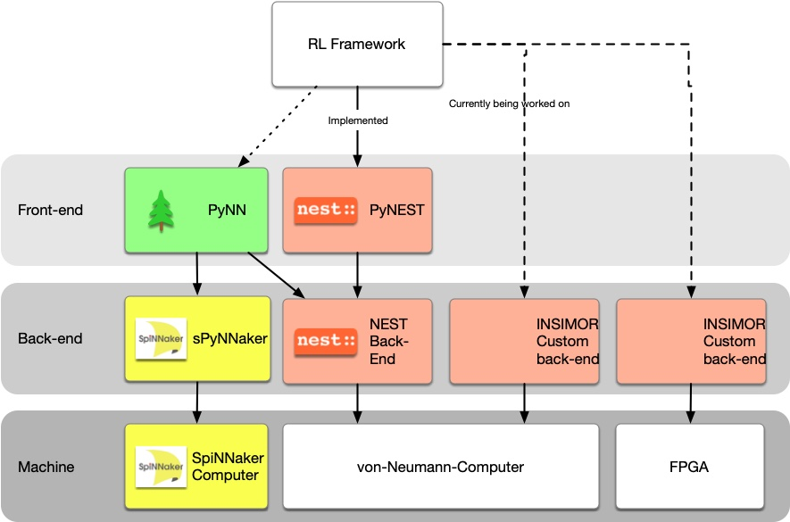

## Motivation	
A Reinforcement Learning (RL) loop with a spiking neural network (SNN) consists of several systems arranged in a feedback-loop.
SNNs integrated with reinforcement learning operate through interconnected feedback systems. My master's thesis research demonstrated how [this reinforcement learning framework](https://github.com/BSVogler/SNN-RL) underlies various approaches to implementing SNN-based controllers. Given that neuromorphic hardware remains in experimental stages with limited availability, simulating these networks on traditional von Neumann architectures presents a practical alternative for research.
In the initial implementation, I utilized NEST, an established SNN framework, as the neural network backend. However, this approach revealed significant performance limitations, particularly for closed-loop simulations. The system's requirement for frequent updates—occurring every few milliseconds at the network edge—created substantial processing delays due to continuous data transfers to the backend. These performance constraints made the system impractical for embedded processors in robotics applications.
To address these performance challenges, we are developing a custom implementation optimized specifically for this framework. The primary optimization strategy involves integrating all system components directly into the simulator backend. Additionally, we are implementing comprehensive multithreading capabilities. In this architecture, the simulation operates as a co-process with configurable parameters, while high-frequency sensor data provides continuous input. Since the simulation typically represents the primary performance bottleneck, it runs continuously, processing the most recent input data.
The impact of spike-to-analog (S2A) conversion is expected to be minimal. If necessary, it could operate as a separate co-process following simulation completion. Further research will evaluate whether the agent's performance benefits more from accessing intermediate results or from utilizing complete but slightly delayed outputs. Similar considerations apply to the feedback function implementation.
This integrated system architecture is designated as INSIMOR (Input, simulation, output, reward/utility function), reflecting its core components and operational flow.

The system is then called:
*In*put, *sim*ulation, *o*utput, *r*eward or utility function, short INSIMOR.

<map name="GraffleExport">
	<area shape=rect coords="691,335,857,430" href="https://github.com/BSVogler/insimor">
	<area shape=rect coords="504,335,670,430" href="https://github.com/BSVogler/insimor">
	<area shape=rect coords="140,331,303,426" href="https://github.com/SpiNNakerManchester/SpyNNaker">
	<area shape=rect coords="140,475,299,570" href="https://apt.cs.manchester.ac.uk/projects/SpiNNaker/project/Access/">
	<area shape=rect coords="140,188,299,283" href="https://neuralensemble.org/PyNN/">
	<area shape=rect coords="317,335,483,430" href="https://nest-simulator.readthedocs.io/en/latest/ref_material/pynest_api/index.html">
	<area shape=rect coords="317,188,483,283" href="https://nest-simulator.readthedocs.io/en/latest/ref_material/pynest_api/index.html">
	<area shape=rect coords="304,1,496,96" href="https://github.com/BSVogler/SNN-RL">
</map>

## Project implementation details
There are two ways to integrate python with C/C++.
This projects contains a c-python/ctypes version and an extension (use with python import statement). Each version is split into its distinct directory.

The python extension is not working yet with python as this needs manual memory managment like reference counting.

For compiling the extension you need to link the libpython3.13.dylib (which links to the python executable via the mach-o file format).
First compile the C++ code of the engine to obtain the shared lib `libinsimou.dylib`. The ctypes work via c so  `extern "C"` is used.

Have an alias to the `libinsimou.dylib` in the same dir.

To test run `python3 testlib.py`

You can run the C++ code (main) when compiling and running the extension project in XCode. 

TODO:
embed back-end in cart-pole

### Performance Numbers
| Implementation | Cycles/ms | ? |
|----------------|-----------|-----|
| INSIMOR core loop C++ implementation | 51953.5 | 48.5278 |
| INSIMOR Python loop | 0.613 | - |
| Python/NumericPyActor | 0.89 | - |
